# 📋 Flujo Completo de Facturación AFIP

## 🎯 Introducción

Este documento describe el flujo completo de facturación desde la creación de una venta en el frontend hasta la emisión de la factura electrónica AFIP y la impresión de tickets.

**Objetivo:** Facturar ventas electrónicamente mediante AFIP (Administración Federal de Ingresos Públicos) de forma segura, transaccional y con manejo de errores robusto.

---

## 🔄 Diagrama de Flujo General

```mermaid
graph TD
    A["👤 Usuario crea Venta"] --> B["📝 VentaModal: Llena datos<br/>Cliente, Artículos, Medio pago"]
    B --> C{"¿Facturar?"}
    C -->|No| D["💾 POST /crear-venta<br/>facturar: 0"]
    C -->|Sí| E["💾 POST /crear-venta<br/>facturar: 1"]
    
    D --> F["🔒 Transacción MySQL"]
    E --> F
    
    F --> G["1️⃣ Crear Venta<br/>INSERT venta"]
    G --> H["2️⃣ Procesar Artículos<br/>INSERT articulo_venta<br/>DESC stock"]
    H --> I["3️⃣ Registrar Pago<br/>INSERT cobro<br/>INSERT venta_cobro"]
    I --> J{"¿Facturar?"}
    
    J -->|No| K["✅ Venta cerrada<br/>estado_factura: NULL"]
    J -->|Sí| L["⏳ Venta con 'error'<br/>estado_factura: 'error'"]
    
    K --> M["🎫 Retorna ID venta"]
    L --> M
    
    M --> N["Frontend recarga<br/>y muestra venta"]
    
    N --> O{"¿Facturación exitosa?"}
    O -->|Sí| P["❓ Modal: ¿Imprimir factura?"]
    O -->|No| Q["❌ Error: mostrar msg"]
    
    P --> R["🔐 FacturaController<br/>procesarFacturacion"]
    
    R --> S["📖 Lee datos BD:<br/>- Venta + total<br/>- Cliente<br/>- Emisor"]
    
    S --> T["🔓 LIBERA conexión MySQL<br/>this.db = null"]
    
    T --> U["⏱️ callAfipService<br/>shell_exec Node.js<br/>Timeout: 15 segundos"]
    
    U --> V{"¿Respuesta AFIP?"}
    
    V -->|Timeout| W["⛔ Timeout<br/>Error: 'No responde'"]
    V -->|Error AFIP| X["⛔ AFIP rechaza<br/>Error: 'Duplicado'"]
    V -->|OK ✅| Y["📬 AFIP aprobó<br/>CAE: 123456789<br/>Nro: 00000001"]
    
    W --> Z["📌 Marca venta 'error'<br/>UPDATE estado_factura"]
    X --> Z
    
    Y --> AA["🔐 Reconecta MySQL"]
    AA --> AB["💾 INSERT factura<br/>INSERT venta_cobro"]
    AB --> AC["🔄 UPDATE venta<br/>id_factura = 789<br/>estado_factura: facturada"]
    
    Z --> AD["🎫 Retorna error"]
    AC --> AE["✅ Retorna:<br/>- id_factura<br/>- CAE<br/>- Datos factura"]
    
    AD --> AF["⚠️ Mostrar error<br/>Usuario puede reintentar"]
    AE --> AG["🖨️ Impresión"]
    
    AG --> AH["1️⃣ Ticket Común<br/>Venta #456, Artículos, Total"]
    AH --> AI["2️⃣ Ticket Factura?<br/>Si usuario dijo 'Sí'<br/>CAE, Nro, Vto"]
    
    AI --> AJ["✅ Fin: Venta facturada"]

    style A fill:#4A90E2
    style F fill:#F5A623
    style T fill:#FF6B6B
    style U fill:#FF6B6B
    style Y fill:#7ED321
    style AJ fill:#7ED321
```



---

## 📊 Fases Detalladas

### **FASE 1: CREACIÓN DE VENTA (Frontend)**

#### Ubicación: `src/views/comercial/VentasView.vue`

**El usuario:**
1. Hace clic en "Nueva Venta"
2. Se abre `VentaModal`
3. Llena:
   - Cliente (o crea uno rápidamente)
   - Equipo
   - Artículos (cantidad, precio, descuento)
   - Medio de pago
   - **Selecciona:** Cerrar y Facturar ✓

**Frontend envía JSON:**
```json
{
  "fecha": "2026-05-05",
  "id_cliente": 5,
  "id_equipo": 3,
  "id_medio_cobro": 1,
  "id_estado_venta": 3,
  "simbolo": "estrella.png",
  "descripcion_cliente": "Venta especial",
  "facturar": 1,
  "articulos": [
    {
      "id_articulo": 10,
      "cantidad": 2,
      "precio_unitario": 100,
      "iva": 0,
      "total": 200
    },
    {
      "id_articulo": 20,
      "cantidad": 1,
      "precio_unitario": 50,
      "iva": 0,
      "total": 50
    }
  ]
}
```

---

### **FASE 2: RECEPCIÓN EN BACKEND (VentaController)**

#### Ubicación: `api/controllers/comercial/VentaController.php`

```php
public function store(int $idUsuario = 0): void
{
    // 1. RECIBE JSON del body
    $data = json_decode(file_get_contents("php://input"), true);

    // 2. VALIDA datos obligatorios
    if (empty($data['fecha']) || empty($data['id_estado_venta'])) {
        $this->respond(400, ['message' => 'Fecha y estado requeridos']);
    }

    if (empty($data['articulos']) || !is_array($data['articulos'])) {
        $this->respond(400, ['message' => 'Debe contener artículos']);
    }

    // 3. ASIGNA símbolo del día (backend es autoridad)
    $data['simbolo'] = SimboloDiaController::obtenerArchivoSimboloDia();

    // 4. LLAMA modelo transaccional
    $result = $this->model->createWithDetails(
        $data,
        $data['articulos'],
        $idUsuario
    );

    if ($result['success']) {
        $this->respond(201, $result);
    } else {
        $this->respond(500, ['message' => $result['error']]);
    }
}
```

---

### **FASE 3: TRANSACCIÓN DE VENTA (Venta.php)**

#### Ubicación: `api/models/comercial/Venta.php`

**Inicia transacción MySQL:**

```php
public function createWithDetails(array $data, array $articulos, ?int $idUsuario = null): array
{
    try {
        $this->conn->beginTransaction();  // ← INICIA TRANSACCIÓN

        // 3.1 - CREAR CLIENTE si viene como temporal
        if (!empty($data['nuevo_cliente'])) {
            $clienteModel = new Cliente($this->conn);
            $idClienteNuevo = $clienteModel->create(
                null,
                $data['nuevo_cliente']['nombre_cliente'],
                $data['nuevo_cliente']['id_condicion_iva_receptor'],
                $data['nuevo_cliente']['direccion'],
                $data['nuevo_cliente']['id_provincia']
            );
            $data['id_cliente'] = $idClienteNuevo;
        }

        // 3.2 - CREAR CABECERA DE VENTA
        $estadoFactura = (!empty($data['facturar']) && $data['facturar']) 
            ? 'error'    // Marca inicial: esperando facturación AFIP
            : null;      // Sin facturación

        $sql = "INSERT INTO venta (fecha, id_equipo, descripcion_cliente, 
                id_estado_venta, simbolo, id_cliente, tipo_vta, estado_factura) 
                VALUES (...)";
        $stmt = $this->conn->prepare($sql);
        $stmt->execute([...]);
        $idVenta = (int)$this->conn->lastInsertId();  // ← ID de venta creada

        // 3.3 - PROCESAR ARTÍCULOS
        foreach ($articulos as $art) {
            // a) Insertar en articulo_venta
            $sqlAV = "INSERT INTO articulo_venta (id_articulo, id_venta, 
                     cantidad, precio_unitario, iva, total) VALUES (...)";
            $stmtAV = $this->conn->prepare($sqlAV);
            $stmtAV->execute([...]);
            $idArticuloVenta = (int)$this->conn->lastInsertId();

            // b) DESCUENTO DE STOCK (FIFO)
            //    Si venta NO está en pausa:
            if (!$esPausa) {
                $lotes = $articuloModel->getLotesDisponibles($art['id_articulo']);
                $cantidadPendiente = (float)$art['cantidad'];

                // Distribuir cantidad contra lotes disponibles
                foreach ($lotes as $lote) {
                    if ($cantidadPendiente <= 0) break;

                    $disponibleEnLote = (float)$lote['disponible'];
                    $aDescontar = min($cantidadPendiente, $disponibleEnLote);

                    // Vincular articulo_venta con ingreso_articulo
                    $sqlAVIA = "INSERT INTO articulo_venta_ingreso_articulo 
                               (articulo_venta_id_articulo_venta, ingreso_articulo_id, cantidad) 
                               VALUES (...)";
                    $stmtAVIA = $this->conn->prepare($sqlAVIA);
                    $stmtAVIA->execute([
                        'id_av'      => $idArticuloVenta,
                        'id_ingreso' => $lote['id'],
                        'cant'       => $aDescontar
                    ]);

                    $cantidadPendiente -= $aDescontar;
                }

                // Si aún hay cantidad (sin stock): registrar como negativo
                if ($cantidadPendiente > 0) {
                    $idLoteFallback = $articuloModel->crearIngresoAjuste($art['id_articulo']);
                    $sqlAVIA = "INSERT INTO articulo_venta_ingreso_articulo 
                               VALUES (...)";
                    $stmtAVIA = $this->conn->prepare($sqlAVIA);
                    $stmtAVIA->execute([...]);
                }
            }
        }

        // 3.4 - REGISTRAR PAGO automático (si es cerrada)
        $totalVentaCalculado = array_sum(array_column($articulos, 'total'));
        
        if ((int)$data['id_estado_venta'] === (int)($data['id_estado_cerrada'] ?? 0)) {
            if (!empty($data['id_medio_cobro'])) {
                $this->registrarPago(
                    $idVenta,
                    (int)$data['id_medio_cobro'],
                    (float)$totalVentaCalculado,
                    $data['fecha'],
                    $idUsuario,
                    false  // No es aditivo
                );
            }
        }

        $this->conn->commit();  // ← COMMIT: todo se persiste

        return ['success' => true, 'id' => $idVenta, 'id_cliente' => $data['id_cliente']];

    } catch (Exception $e) {
        if ($this->conn->inTransaction()) {
            $this->conn->rollBack();  // ← ROLLBACK: deshace todo si hay error
        }
        return ['success' => false, 'error' => $e->getMessage()];
    }
}
```

---

### **FASE 4: RESPUESTA AL FRONTEND**

Backend retorna:
```json
{
  "success": true,
  "id": 456,
  "id_cliente": 5
}
```

Frontend:
- Recarga lista de ventas
- Muestra toast: "Venta creada"
- Si `facturar=1` → Automáticamente llama a `imprimirTicketDirecto(456)`

---

### **FASE 5: PREPARACIÓN DE FACTURACIÓN (FacturaController)**

#### Ubicación: `api/controllers/comercial/FacturaController.php::procesarFacturacion`

```php
public function procesarFacturacion(int $idVenta): array
{
    // FASE 5.1 - LEER DATOS (conexión MySQL ABIERTA)
    
    // 1. Obtener venta + total calculado
    $stmt = $this->db->prepare("
        SELECT v.*,
               COALESCE(SUM(av.total), 0) AS importe_total
        FROM venta v
        LEFT JOIN articulo_venta av ON av.id_venta = v.id
        WHERE v.id = ?
        GROUP BY v.id
    ");
    $stmt->execute([$idVenta]);
    $venta = $stmt->fetch(PDO::FETCH_ASSOC);

    if (!$venta) {
        return ['success' => false, 'error' => 'Venta no encontrada'];
    }

    // 2. VERIFICAR LÍMITE DIARIO
    $estadoDiario = $this->getEstadoDiarioData((float)$venta['importe_total']);
    if (!$estadoDiario['puede_facturar']) {
        return [
            'success'       => false,
            'limite_diario' => true,
            'error'         => "Límite diario alcanzado ({$estadoDiario['acumulado']} / {$estadoDiario['limite']})"
        ];
    }

    // 3. IDEMPOTENCIA: si ya tiene factura con CAE, devolver la existente
    if (!empty($venta['id_factura'])) {
        $factExistente = $this->facturaModel->getById((int)$venta['id_factura']);
        if ($factExistente && !empty($factExistente['cae'])) {
            return [
                'success'        => true,
                'already_issued' => true,
                'id_factura'     => $factExistente['Id_factura'],
                'cae'            => $factExistente['cae'],
                'factura'        => $factExistente
            ];
        }
    }

    // 4. Obtener datos del Emisor
    $stmtEmisor = $this->db->query("
        SELECT e.*, 
               tc.tipo_comp as codigo_afip_comprobante,
               tn.cod_concepto as codigo_afip_concepto
        FROM facturacion_datos_emisor e
        LEFT JOIN tipo_comprobante tc ON tc.Id_tipo_comp = e.id_tipo_comprobante
        LEFT JOIN tipo_concepto tn ON tn.Id_tipo_concepto = e.Id_tipo_concepto
        LIMIT 1
    ");
    $emisor = $stmtEmisor->fetch(PDO::FETCH_ASSOC);

    if (!$emisor) {
        return ['success' => false, 'error' => 'No hay datos de emisor configurados'];
    }

    // 5. Obtener datos del Cliente (receptor)
    $receptor = null;
    if (!empty($venta['id_cliente'])) {
        $stmtCliente = $this->db->prepare("
            SELECT c.*, p.provincia AS nombre_provincia
            FROM cliente c
            LEFT JOIN provincia p ON p.id = c.id_provincia
            WHERE c.id = ?
        ");
        $stmtCliente->execute([$venta['id_cliente']]);
        $receptor = $stmtCliente->fetch(PDO::FETCH_ASSOC);
    }

    // Si no hay cliente: Consumidor Final
    if (!$receptor) {
        $receptor = [
            'nombre_cliente'             => 'Consumidor Final',
            'id_condicion_iva_receptor'  => 2,
            'cuit_dni'                   => '0',
            'direccion'                  => null,
            'nombre_provincia'           => null
        ];
    }

    // 6. PREPARAR PAYLOAD para AFIP
    $payload = $this->prepareAfipPayload($venta, (float)$venta['importe_total'], $emisor, $receptor);

    // ✅ ✅ ✅ FASE CRÍTICA: LIBERAR CONEXIÓN MYSQL ✅ ✅ ✅
    $this->db = null;  // Cierra la conexión PDO

    // FASE 5.2 - LLAMAR A AFIP (puede tardar 5-30 segundos)
    $afipResponse = $this->callAfipService($payload);

    // FASE 5.3 - RECONECTAR A MYSQL
    $dbReconnect = new Database();
    $this->db = $dbReconnect->connect();
    $this->facturaModel = new Factura($this->db);

    if (!$afipResponse['success']) {
        return ['success' => false, 'error' => $afipResponse['error']];
    }

    // FASE 5.4 - PERSISTIR FACTURA
    $idFactura = $this->facturaModel->create([
        'Id_maestro'                 => $idVenta,
        'cuit_dni_receptor'          => $payload['docNro'],
        'nombre_receptor'            => $receptor['nombre_cliente'],
        'Id_condicion_IVA_comprador' => (int)$receptor['id_condicion_iva_receptor'],
        'id_tipo_comprobante'        => (int)$emisor['id_tipo_comprobante'],
        'fecha_emision'              => date('Y-m-d H:i:s'),
        'fecha_desde'                => date('Y-m-01', strtotime($venta['fecha'])),
        'fecha_hasta'                => date('Y-m-t',  strtotime($venta['fecha'])),
        'Id_tipo_concepto'           => (int)$emisor['Id_tipo_concepto'],
        'Id_alicuota_IVA'            => 5,
        'IVA'                        => 0,
        'importe_total'              => $venta['importe_total'],
        'Direccion_receptor'         => $receptor['direccion'],
        'Localidad_receptor'         => null,
        'Provincia_receptor'         => $receptor['nombre_provincia'],
        'nro_comprobante'            => $afipResponse['nro_comprobante'],
        'pto_venta'                  => $afipResponse['pto_venta'],
        'cae'                        => $afipResponse['cae'],
        'vto_cae'                    => $afipResponse['vto_cae'],
        'descripcion'                => $venta['descripcion_cliente']
    ]);

    if (!$idFactura) {
        return ['success' => false, 'error' => 'AFIP aprobó pero no se pudo guardar factura'];
    }

    // FASE 5.5 - ACTUALIZAR VENTA
    $updVenta = $this->db->prepare("
        UPDATE venta
        SET id_factura    = ?,
            estado_factura = 'facturada'
        WHERE id = ?
    ");
    $updVenta->execute([$idFactura, $idVenta]);

    return [
        'success'    => true,
        'id_factura' => $idFactura,
        'cae'        => $afipResponse['cae'],
        'factura'    => $this->facturaModel->getById($idFactura)
    ];
}
```

---

### **FASE 6: LLAMADA A AFIP CON TIMEOUT**

#### Ubicación: `api/controllers/comercial/FacturaController.php::callAfipService`

```php
private function callAfipService(array $payload): array
{
    // Configurar Node.js
    $nodeBin = '/home/impactos/nodevenv/franconovara/afip-service/20/bin/node --tls-cipher-list="DEFAULT@SECLEVEL=1"';
    $scriptPath = '/home/impactos/nodevenv/franconovara/afip-service/ilcalciocamp/facturar-ilcalciocamp.js';

    $payloadBase64 = base64_encode(json_encode($payload));
    $command = "$nodeBin \"$scriptPath\" " . escapeshellarg($payloadBase64);

    error_log("AFIP-COMMAND [IlCalcio]: $command");

    // Ejecutar con TIMEOUT de 15 segundos
    $outputString = $this->shellExecWithTimeout($command, 15);

    // Si fue timeout (null)
    if ($outputString === null) {
        error_log("AFIP-SERVICE [IlCalcio] Timeout: no se obtuvo respuesta en 15 segundos");
        return [
            'success' => false,
            'error'   => 'Timeout comunicándose con AFIP. Intente nuevamente.'
        ];
    }

    error_log("AFIP-OUTPUT [IlCalcio]: $outputString");

    // Parsear respuesta JSON
    $lines = array_filter(array_map('trim', explode("\n", $outputString)));
    $lastLine = end($lines);
    $response = $lastLine ? json_decode($lastLine, true) : null;

    if ($response && isset($response['success'])) {
        if ($response['success']) {
            // Normalizar campos
            $response['nro_comprobante'] = $response['nro']    ?? null;
            $response['vto_cae']         = $response['vto']    ?? null;
            $response['pto_venta']       = $response['ptovta'] ?? null;
            $response['tipo_cbte']       = $response['tipo']   ?? null;
            $response['cae']             = $response['cae']    ?? null;
        } else {
            error_log("AFIP-SERVICE [IlCalcio] Error: " . ($response['error'] ?? 'Unknown'));
        }
        return $response;
    }

    error_log("AFIP-SERVICE [IlCalcio] Error crítico: respuesta inválida. Salida: $outputString");
    return [
        'success' => false,
        'error'   => 'Error de comunicación con AFIP'
    ];
}

/**
 * Ejecuta comando con timeout (mata proceso si tarda demasiado)
 */
private function shellExecWithTimeout(string $command, int $timeoutSeconds = 15): ?string
{
    $process = proc_open(
        $command,
        [1 => ['pipe', 'w'], 2 => ['pipe', 'w']],
        $pipes
    );

    if (!is_resource($process)) {
        error_log("[AFIP-TIMEOUT] No se pudo abrir proceso");
        return null;
    }

    $startTime = time();
    $output = '';
    stream_set_blocking($pipes[1], false);
    stream_set_blocking($pipes[2], false);

    while (true) {
        $status = proc_get_status($process);
        $output .= stream_get_contents($pipes[1]);

        if (!$status['running']) {
            $output .= stream_get_contents($pipes[1]);
            fclose($pipes[1]);
            fclose($pipes[2]);
            proc_close($process);
            return $output;
        }

        // Verificar timeout
        if ((time() - $startTime) > $timeoutSeconds) {
            error_log("[AFIP-TIMEOUT] Excedido límite de {$timeoutSeconds}s");
            proc_terminate($process, 9);  // SIGKILL
            usleep(100000);
            proc_close($process);
            fclose($pipes[1]);
            fclose($pipes[2]);
            return null;
        }

        usleep(50000);  // 50ms
    }
}
```

---

### **FASE 7: MANEJO DE ERRORES**

#### Si AFIP rechaza:

```php
// Marcar venta como error/rechazada
public function marcarPendienteAfip(): void
{
    $data     = json_decode(file_get_contents("php://input"), true) ?? [];
    $idVenta  = (int)($data['id_venta'] ?? 0);
    $errorMsg = $data['error_msg'] ?? '';
    $rechazar = (bool)($data['rechazar'] ?? false);

    $nuevoEstado = $rechazar ? 'rechazada' : 'error';

    $stmt = $this->db->prepare("
        UPDATE venta
        SET estado_factura = ?
        WHERE id = ?
    ");
    $stmt->execute([$nuevoEstado, $idVenta]);

    error_log("[AFIP][Venta #{$idVenta}] Fallo: {$errorMsg}");

    $this->respond(200, ['message' => "Estado actualizado a {$nuevoEstado}"]);
}
```

---

### **FASE 8: IMPRESIÓN DE TICKETS**

#### Ubicación: Frontend después de facturación exitosa

**Ticket Común (siempre):**
```
┌─────────────────────────────┐
│      IL CALCIO CAMP         │
│    Ticket de Venta #456     │
│                             │
│  Fecha: 05/05/2026          │
│                             │
│  Cliente: Juan Pérez        │
│  Equipo: River Plate        │
│                             │
│  2x Artículo A         $200 │
│  1x Artículo B          $50 │
│                             │
│  ─────────────────────────  │
│  TOTAL:                $250 │
│  Pago: Efectivo             │
│                             │
│  ─────────────────────────  │
│                             │
│  ¡Gracias por su compra!    │
│                             │
└─────────────────────────────┘
```

**Ticket Factura (si usuario eligió):**
```
┌─────────────────────────────┐
│      FACTURA C #001         │
│                             │
│  CAE: 20260505123456        │
│  Vto CAE: 15/05/2026        │
│                             │
│  Consumidor Final           │
│  Importe: $250              │
│                             │
└─────────────────────────────┘
```

---

## 🛡️ Características de Seguridad

### 1. **Transaccionalidad MySQL**
- Si cualquier paso falla → `ROLLBACK` automático
- Garantiza consistencia: venta + artículos + stock + pago

### 2. **Liberación de Conexión antes de AFIP**
- Evita saturación de conexiones bajo carga
- Mata proceso Node.js si tarda > 15 segundos

### 3. **Idempotencia**
- Si se reintenta facturación de venta ya facturada → devuelve CAE anterior
- Previene duplicados en AFIP

### 4. **Límite Diario**
- Verifica acumulado de facturación antes de enviar a AFIP
- Si se excede → bloquea y marca como 'error'

### 5. **Manejo de Errores Robusto**
- Timeout en llamada a AFIP
- Validaciones antes de persistir
- Logs detallados para debugging

---

## 📊 Estados de Venta - Máquina de Estados

```
ABIERTA (id=2)
    ↓
    ├─→ CERRADA (id=3) con facturar=0
    │        ↓
    │        └─→ Venta cerrada (estado_factura: NULL)
    │
    ├─→ CERRADA (id=3) con facturar=1
    │        ↓
    │        └─→ estado_factura: 'error' (inicial)
    │             ↓
    │             ├─→ Facturación exitosa
    │             │    ↓
    │             │    └─→ estado_factura: 'facturada' ✅
    │             │
    │             └─→ Facturación falla (AFIP rechaza)
    │                  ↓
    │                  └─→ estado_factura: 'error' o 'rechazada'
    │                       Usuario puede reintentar
    │
    └─→ PAUSA (id=4)
         ↓
         └─→ Venta pausada (sin facturación)
             Usuario puede reactivar después
```

---

## 🔗 Integración AFIP

### Node.js Script: `facturar-ilcalciocamp.js`

Recibe:
```json
{
  "cuit": "30123456789",
  "monto": 250,
  "ptoVta": 1,
  "tipoCbte": 11,
  "docTipo": 99,
  "docNro": "0",
  "condicionIva": 5,
  "concepto": 1,
  "cbteFch": "20260505",
  "fechaDesde": "20260501",
  "fechaHasta": "20260531",
  "fechaVto": "20260515"
}
```

Retorna:
```json
{
  "success": true,
  "cae": "20260505123456",
  "nro": "00000001",
  "pto": "0001",
  "vto": "20260515"
}
```

O en caso de error:
```json
{
  "success": false,
  "error": "Número de comprobante duplicado"
}
```

---

## 📋 Tabla Resumen de Fases

| Fase | Actor | Acción | Duración | Estado BD |
|------|-------|--------|----------|-----------|
| 1 | Frontend | Usuario crea venta | ~2s | - |
| 2 | Frontend | POST /crear-venta | ~1s | - |
| 3 | Backend | Transacción MySQL | ~0.5s | Venta creada |
| 4 | Backend | Retorna ID venta | ~0.1s | - |
| 5 | Frontend | Recarga y pregunta | ~1s | - |
| 6 | Backend | Lee datos BD | ~0.5s | - |
| 7 | Backend | LIBERA conexión | instant | ✅ |
| 8 | Node.js + AFIP | Facturación | 2-30s | - |
| 9 | Backend | RECONECTA MySQL | ~0.1s | ✅ |
| 10 | Backend | Persiste factura | ~0.5s | Factura creada |
| 11 | Frontend | Imprime tickets | ~2s | ✅ Final |

---

## ⚠️ Puntos Críticos (Mejoras Implementadas)

| Problema | Antes | Ahora |
|----------|-------|-------|
| **Conexión bloqueada durante AFIP** | MySQL abierta 5-30s | ✅ Libera antes, reconecta después |
| **Sin timeout en AFIP** | Espera indefinida | ✅ Timeout 15s, mata proceso |
| **Subqueries correlacionadas** | O(n × 2) queries | ✅ LEFT JOIN agregado: O(1) scan |
| **Sin manejo idempotencia** | Duplicados posibles | ✅ Verifica CAE anterior |
| **Reintentos infinitos** | No había | ✅ Documentado: fail-fast |

---

## 📚 Archivos Relacionados

### Modelos
- `api/models/comercial/Venta.php` - Lógica transaccional de venta
- `api/models/comercial/Factura.php` - CRUD de facturas
- `api/models/inventario/Articulo.php` - Manejo de stock FIFO

### Controllers
- `api/controllers/comercial/VentaController.php` - Endpoints de venta
- `api/controllers/comercial/FacturaController.php` - Endpoints de facturación
- `api/controllers/comercial/TicketVentaController.php` - Generación de PDFs

### Frontend
- `src/views/comercial/VentasView.vue` - UI principal de ventas
- `src/services/comercial/ventasService.js` - API client para ventas
- `src/services/comercial/facturaService.js` - API client para facturación
- `src/composables/usePrinterConfig.js` - Configuración QZ Tray (impresoras)

### Base de Datos
- `venta` - Cabecera de venta
- `articulo_venta` - Línea de articulos por venta
- `articulo_venta_ingreso_articulo` - Vinculación stock FIFO
- `venta_cobro` - Relación venta-pago
- `cobro` - Registro de pagos
- `factura` - Facturas emitidas

---

## 🚀 Cómo Usar

### Crear y Facturar una Venta

1. Acceder a **Comercial > Ventas**
2. Clic en **+ Nueva Venta**
3. Llenar datos:
   - Cliente
   - Equipo
   - Artículos (agregar líneas)
   - Medio pago
4. Marcar **"Cerrar y Facturar"** ✓
5. Clic en **Guardar**
6. Cuando pregunte **¿Imprimir factura?**:
   - **Sí** → Imprime ticket + factura
   - **No** → Solo ticket común

### Si hay Error de Facturación

1. Venta se crea normalmente
2. Estado aparece como **"Error facturación"**
3. Usuario puede:
   - **Editar** venta
   - **Reintentar** facturación
   - O dejar como está (manual después)

---

## 📞 Troubleshooting

| Problema | Causa | Solución |
|----------|-------|----------|
| "Timeout AFIP" | Servidor AFIP lento/caído | Reintentar en 5 minutos |
| "Límite diario alcanzado" | Se excedió monto diario | Esperar a mañana o aumentar límite |
| "Número duplicado" | CAE ya existe | AFIP rechazó, pero check factura anterior |
| "No hay impresora" | QZ Tray desconectado | Instalar QZ Tray y configurar |
| Stock negativo | Más venta que ingreso | Sistema permite, revisar stock |

---

**Última actualización:** 5 de Mayo de 2026  
**Versión:** 1.0  
**Autor:** Sistema IL CALCIO CAMP
